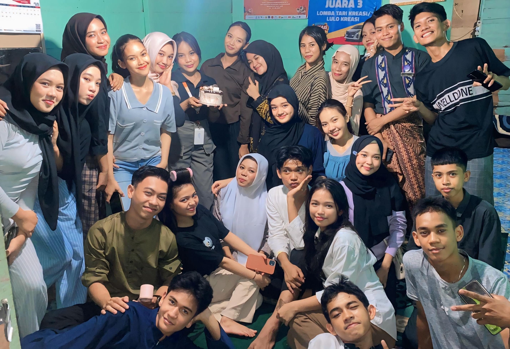
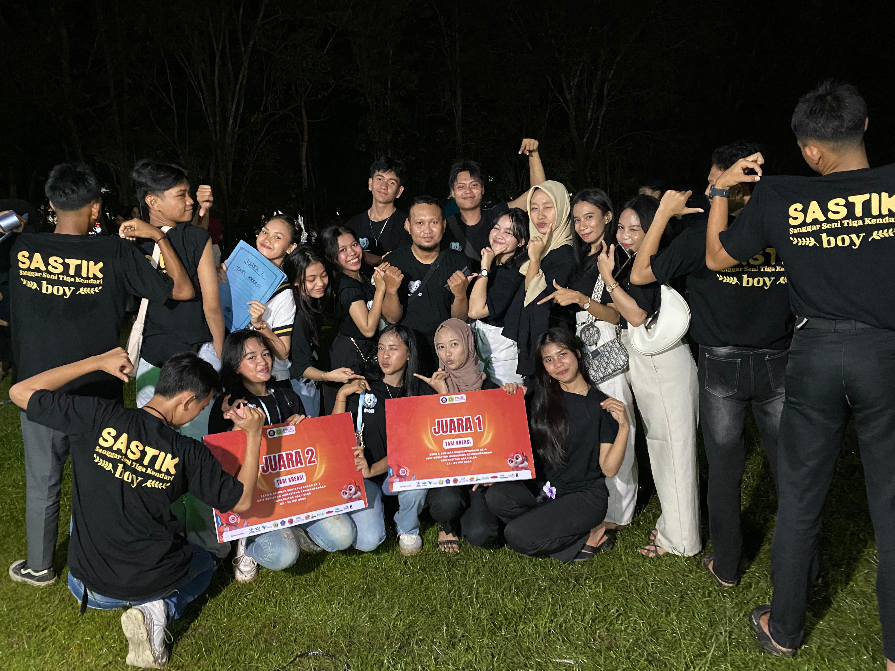
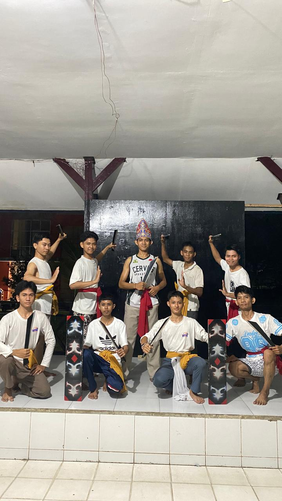
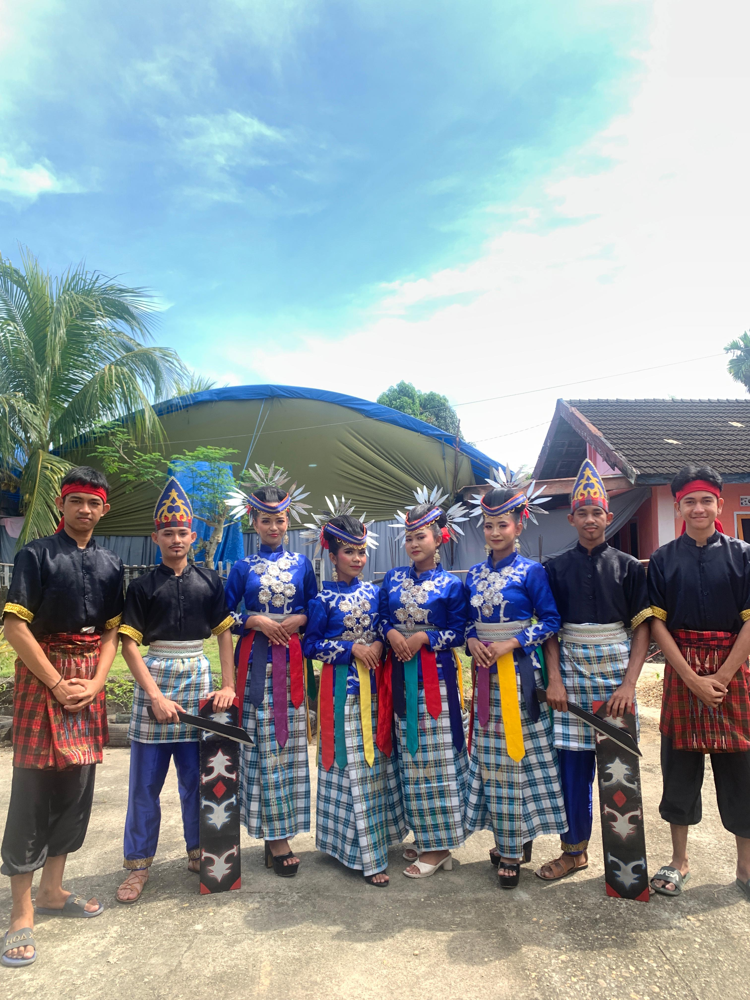

<!DOCTYPE html>
<html lang="id">
<head>
  <meta charset="utf-8" />
  <meta name="viewport" content="width=device-width,initial-scale=1" />
  <title>SASTIK - Sanggar Seni Tiga Kendari</title>
  <meta name="description" content="Website resmi Sanggar Seni Tiga Kendari (SASTIK) – Sanggar seni tari tradisional dan modern dari Kendari." />
  <link href="https://fonts.googleapis.com/css2?family=Poppins:wght@300;400;600;700&display=swap" rel="stylesheet">
  
</head>
<body>

  <header>
    <h1>SASTIK</h1>
    <nav>
      <ul>
        <li><a href="#beranda">Beranda</a></li>
        <li><a href="#profil">Profil</a></li>
        <li><a href="#tarian">Tarian</a></li>
        <li><a href="#galeri">Galeri</a></li>
      </ul>
    </nav>
  </header>

  <section id="beranda" class="hero">
    

      <h2>Sanggar Seni Tiga Kendari (SASTIK)</h2>
      
Tempat kami menyalurkan cinta terhadap budaya dan tarian tradisional. Di SASTIK, menari bukan sekadar gerak, tetapi juga wujud rasa, makna, dan kebersamaan keluarga seni.

    

    

      
    

  </section>

  <section id="profil" class="profil">
    <h2 class="section-title">Profil Sanggar</h2>
    
Menjaga dan melestarikan seni tari tradisional Kendari

    

      
      

        
SASTIK (Sanggar Seni Tiga Kendari) didirikan dengan semangat untuk melestarikan budaya lokal melalui tari. Kami adalah keluarga besar penari muda yang berlatih, tampil, dan berbagi kebahagiaan lewat gerak dan irama.

        
Dengan pelatih berpengalaman dan anggota yang solid, kami telah tampil di berbagai acara budaya dan festival daerah. Kami percaya bahwa setiap gerakan memiliki cerita dan setiap tarian adalah warisan.

      

    

  </section>

  <section id="tarian" class="tarian">
    <h2 class="section-title">Tarian Kami</h2>
    
Karya tari yang pernah kami tampilkan

    

      

        
        <h3>Tari Haluoleo</h3>
        
Tari penyambutan khas Sulawesi Tenggara yang menggambarkan kehangatan dan persaudaraan.

      

      

        
        <h3>Tari Amoara</h3>
        
Tarian energik yang menggambarkan semangat perjuangan dan kebersamaan antar pemuda.

      

    

  </section>

  <section id="galeri" class="galeri">
    <h2 class="section-title">Galeri</h2>
    
Kenangan penampilan dan latihan kami

    <!-- ✅ Carousel rapi -->
    

      <input type="radio" name="slider" id="slide-1" checked>
      <input type="radio" name="slider" id="slide-2">
      <input type="radio" name="slider" id="slide-3">
      

        

          
          
Latihan Tari

        

        

          
          
Pentas Seni

        

        

          
          
Kebersamaan SASTIK

        

      

      

        <label for="slide-1" class="dot"></label>
        <label for="slide-2" class="dot"></label>
        <label for="slide-3" class="dot"></label>
      

    

  </section>

  <footer>
    
&copy; 2025 SASTIK - Sanggar Seni Tiga Kendari

  </footer>

  

</body>
</html>

      
             
